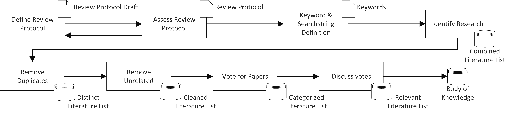

# VMBoK

A Variability Modeling Body of Knowledge of Systematic Literature Reviews.

[](https://doi.org/10.1109/SEAA53835.2021.00012)

```
@INPROCEEDINGS{FeichtingerVMBoK2021,  
 author={Feichtinger, Kevin and Meixner, Kristof and Rabiser, Rick and Biffl, Stefan},  
 booktitle={2021 47th Euromicro Conference on Software Engineering and Advanced Applications (SEAA)},   
 title={A Systematic Study as Foundation for a Variability Modeling Body of Knowledge},   
 year={2021},  
 volume={},  
 number={},  
 pages={25-28},  
 doi={10.1109/SEAA53835.2021.00012}}
```

## Systematic Mapping Study Protocol



### Phase 0: 

We conducted a pilot search (using Google Scholar and the digital libraries of ACM Digital, IEEE Xplore, Scopus, SpringerLink, and Web of Science) to develop a suitable search process and scope. Based on the pilot study results, we decided to investigate the digital libraries of ACM Digital, IEEE Xplore, Scopus, and Web of Science in our systematic tertiary mapping study. Further, we defined the following inclusion/exclusion criteria:

**Hard Inclusion criteria:**
-   **Accessible:** The full text of the paper is available online and can be downloaded from the digital library.
-   **English:** The paper is written in English
-   **Full/Short Paper:** The paper is a short or full paper. We do not include (extended) abstracts or posters.
-   **Peer-Reviewed:** The paper is peer-reviewed or of verifiable quality (e.g., well-known technical reports).

**Selective Inclusion criteria:**
-   **Secondary Literature Study:** The paper presents a systematic mapping/survey/literature study. We do not include literature studies that do not follow a sufficiently reproducible process. 
-   **Comparative Primary Study:** The paper compares different variability modeling approaches after 2020
-   **Recent Study:** The paper presents a recent study on variability modeling approaches after 2020.

**Exclusion criteria:**
-   **Theoretical approach:** The paper presents only a theoretical approach without practical use or model
-   **Citation/Patent:** The document is only available as a citation or (is part of an) patent
-   **Semantic Duplicate:** The paper is a clear semantic duplicate of another paper with no apparent additional contribution.

Based on the scope of the study, to create a Body of Knowledge for Systematic Reviews and relevant studies in Variability Modeling, we defined multiple search strings, which we again tested in an initial pilot (using Google Scholar). Based on the results, we defined the following search string to identify relevant research in variability modeling research.

`("variabilit*" OR "product* famil*" OR "process* famil*" OR "product* line*" OR "process* line*" AND "systematic" OR "review" OR "study" OR "survey" OR "comparison" OR "mapping" OR "literature")`

### Phase 1: 

In Phase 1, we performed the literature search among the digital libraries of ACM Digital, IEEE Xplore, Scopus, and Web of Science. We defined several optimized search strings for the four digital libraries Scopus, IEEE Xplore, Web of Science, and ACM Digital, which we used to conduct a manual search. 
The original search string and the optimized search strings can be found here:

[Scopus](/protocol/searchStrings/scopus.txt)

[IEEE Xplore](/protocol/searchStrings/ieee.txt)

[Web of Science](/protocol/searchStrings/wok.txt)

[ACM Digital](/protocol/searchStrings/acm.txt)

We investigated the resulting set of papers and removed duplicates and papers irrelevant for the study (e.g., based on keywords like ***heart rate variability*** or the DOIs of medical journals).

### Phase 2:

For the selection process (independent voting of participating researchers + rationale) of the remaining papers, we used a Google Spreadsheet. The voting was performed based on ***simple majority vote***. If the simple majority of participating researchers resulted in an include, we included the paper in the BoK. Similarly, papers receiving an exclude vote were not included in the BoK. If the result was inconclusive, the paper was marked as uncertain. We discussed the uncertain papers in a dedicated meeting. The resulting Voting Table of all participating researchers can be found here:

[Complete Voting Table](/protocol/votingtable-feb-2021-original.pdf)
 
We reduced a potential bias towards particular votes by separating the individual voting sheets. Therefore, we copied the initial spreadsheet for each participating researcher, such that each researcher voted on their respective voting table. After finishing the voting, the results were combined into the primary voting table. A colleague (not affiliated with this work) maintained each spreadsheet so that the researchers could not access the others' voting tables.

### Phase 3:

We updated the VMBoK by paper published 2021, which are in scope of the VMBoK, by redoing Phase 1 and 2 for only 2021. We also performed snowballing for selected SLRs to find may overlooked papers in the same manner. The voting table was repeated by 3 PhD students (two of them were part of the original voting). The results of the voting can be found here:

[Complete Voting Table](/protocol/votingtable-jan-2022-papers.pdf)
